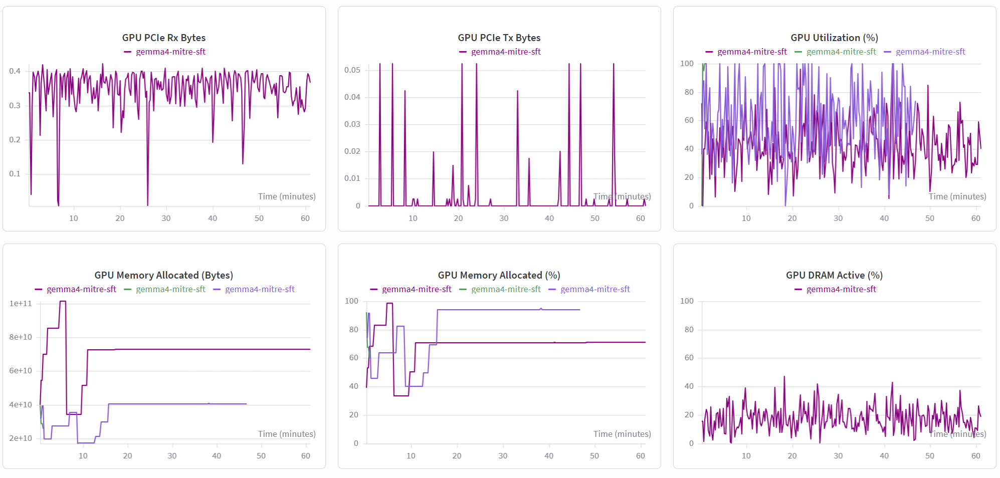
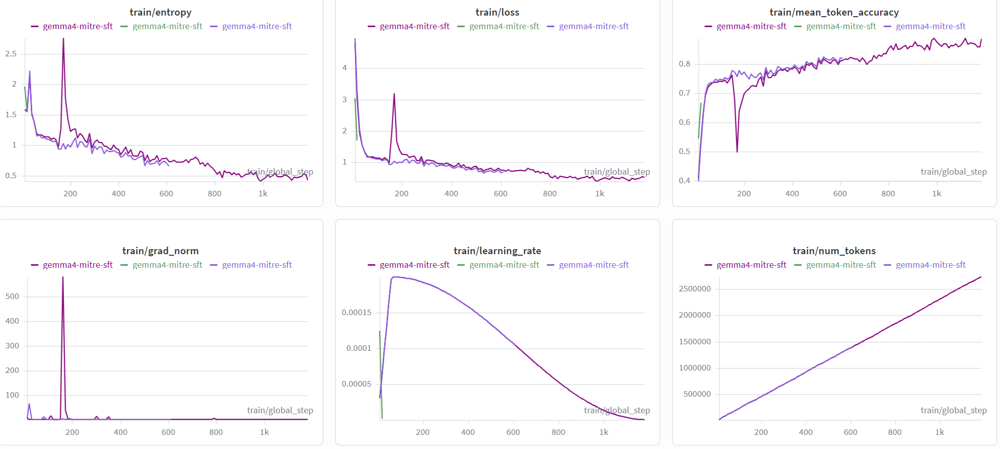
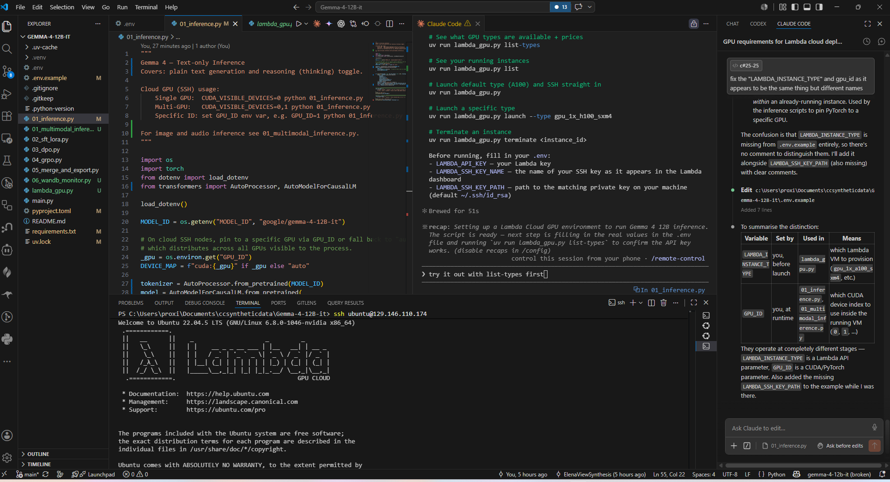

# Gemma 4 12B-IT — MITRE ATT&CK Fine-tuning on Lambda GPU with Profiling

### Training Runtime Benchmark

Runtime comparison for fine-tuning `gemma-4-12b-it` on Lambda GPU instances (MITRE ATT&CK SFT, full run — **1,185 training steps**).

| GPU Instance | Hardware | VRAM | Runtime | Price | Est. Cost |
|---|---|---:|---:|---:|---:|
| GH200 | ARM64 + H100 (Hopper) | 96 GB unified | 57 min | — | ~$2.29 |
| A100 SXM4 | x86-64 (Ampere) | 40 GB | 1h 37m | $1.99/hr | ~$3.22 |

The GH200 was **40 min faster and ~$1 cheaper** on this workload. The unified 96 GB memory eliminates the VRAM pressure that forces gradient checkpointing and smaller micro-batches on the A100 40 GB, and Hopper-class bf16 throughput is meaningfully higher than Ampere.

**Note:** The GH200 runs Ubuntu on ARM64 (`aarch64`). The Nsight setup script (`scripts/setup_lambda_nsight.sh`) handles the ARM64-specific `libbpf.so.1` and `libssh` symbol issues automatically — see the [Profiling with Nsight Systems](#profiling-with-nsight-systems-and-nsight-compute) section below.

---

## Gemma 4 12B-IT — Lambda Cloud GPU Guide

### GH200 GPU Utilisation During Training



WandB system metrics captured during the full 1,185-step MITRE ATT&CK SFT run on a Lambda `gpu_1x_gh200` (ARM64, 96 GB unified memory):

| Metric | Observed behaviour |
|---|---|
| **GPU Utilisation (%)** | Highly variable — oscillates between 20–100%, averaging ~60%. Typical for QLoRA fine-tuning where compute bursts are interleaved with data loading and gradient steps. |
| **GPU Memory Allocated (Bytes)** | Steps up in stages during model + optimizer load (~2×10¹⁰ → ~7×10¹⁰ bytes), then holds flat for the rest of the run — confirming no memory leak. |
| **GPU Memory Allocated (%)** | Stabilises at ~75–95% after the first 15 minutes, making good use of the 96 GB unified pool without OOM risk. |
| **GPU DRAM Active (%)** | Stays in the 10–40% range throughout — DRAM bandwidth is not the bottleneck on this workload. |
| **GPU PCIe Rx Bytes** | Steady ~0.3 GB/s inbound — consistent with continuous batch transfers from host to device. |
| **GPU PCIe Tx Bytes** | Sparse spikes up to ~0.05 GB/s — gradient or checkpoint writes back to host, infrequent as expected. |

The flat memory profile and consistent PCIe Rx throughput confirm the GH200's unified memory architecture is well-suited to this workload — no swapping, no OOM, and the large pool eliminates the gradient checkpointing overhead that squeezes A100 40 GB runs.

---

### Memory Footprint

| Component | VRAM |
|---|---|
| Model weights (12B × bf16) | ~24 GB |
| KV cache (1024 tokens, batch=1) | ~2–4 GB |
| Multimodal inputs (image/audio) | ~1–3 GB |
| **Total minimum** | **~28–31 GB** |

### Lambda GPU Instance Recommendations

| Instance | GPU | VRAM | Verdict |
|---|---|---|---|
| `gpu_1x_a100_sxm4` | 1× A100 80GB | 80 GB | **Recommended** — plenty of headroom for multimodal |
| `gpu_1x_h100_sxm5` | 1× H100 80GB | 80 GB | Best performance (faster bf16 throughput) |
| `gpu_2x_a100` | 2× A100 40GB | 80 GB total | Works with `device_map="auto"` |
| `gpu_1x_a100` | 1× A100 40GB | 40 GB | Tight but works; limit batch size and context length |
| `gpu_1x_a10` | 1× A10 | 24 GB | **Too small** — model weights alone hit 24 GB |

**Minimum viable:** 1× A100 40GB  
**Recommended:** 1× A100 80GB or 1× H100 80GB

### Launch Commands (SSH)

```bash
# Single A100 80GB
CUDA_VISIBLE_DEVICES=0 python 01_inference.py

# Multi-GPU (2× A100 40GB), device_map="auto" shards automatically
CUDA_VISIBLE_DEVICES=0,1 python 01_inference.py

# Pin to a specific GPU
GPU_ID=1 python 01_inference.py
```

### CUDA / Driver Requirements

- CUDA **12.1+** (Lambda standard images ship with 12.x)
- Driver **525+** for A100, **530+** for H100
- Python **3.10+**, PyTorch **2.3+**

The A100 80GB SXM4 instance covers inference, LoRA fine-tuning, DPO, and GRPO all on a single node.

---

### SSH Key Setup for Lambda Cloud

**1. Generate an SSH key pair** (skip if you already have one):
```bash
ssh-keygen -t ed25519 -C "lambda-gpu" -f ~/.ssh/lambda_gpu
```

**2. Add the public key to Lambda Cloud:**
- Go to [lambdalabs.com/cloud/ssh-keys](https://lambdalabs.com/cloud/ssh-keys)
- Click **Add SSH Key**, paste the contents of `~/.ssh/lambda_gpu.pub`
- Give it a name — this becomes your `LAMBDA_SSH_KEY_NAME` in `.env`

**3. Fill in `.env`:**
```bash
cp .env.example .env
```
```env
LAMBDA_API_KEY=your_lambda_api_key
LAMBDA_SSH_KEY_NAME=lambda-gpu          # name you gave the key on Lambda
LAMBDA_SSH_KEY_PATH=~/.ssh/lambda_gpu   # path to the private key on your machine
LAMBDA_INSTANCE_IP=132.226.76.207       # current running instance, for direct SSH
```

**4. Launch and connect:**
```bash
uv run lambda_gpu.py                        # launches default instance and SSHs in
uv run lambda_gpu.py --type gpu_1x_h100_sxm4  # specific instance type
```

**Connect to the current running instance:**
```bash
ssh ubuntu@132.226.76.207
ssh -i ~/.ssh/lambda_gpu ubuntu@132.226.76.207
uv run lambda_gpu.py connect 132.226.76.207
```

---

### Deploying to the GPU Instance

**1. Sync the project from local WSL to the instance:**
```bash
rsync -av --exclude .venv --exclude .uv-cache --exclude .git \
  ~/project/ \
  ubuntu@<instance-ip>:~/project/
```

**2. On the Lambda instance — verify CUDA and install deps:**
```bash
cd ~/project
nvidia-smi
python3 --version
python3 -m venv .venv
source .venv/bin/activate
pip install -U pip
pip install -r requirements.txt
```

**3. Authenticate:**
```bash
hf auth login
wandb login
```

**WandB training dashboard:**
[wandb.ai/elenamylocuda-gemma/gemma-4-12b](https://wandb.ai/elenamylocuda-gemma/gemma-4-12b?nw=nwuserelenamylocuda)

**Training metrics (1,185 steps — GH200, ARM64):**



| Metric | Behaviour |
|---|---|
| `train/loss` | Starts ~4.5, drops sharply to ~0.5 by step 400, continues declining to ~0.4 at step 1185 |
| `train/entropy` | Mirrors loss — falls from ~2.0 to ~0.45, indicating the model becomes more confident |
| `train/mean_token_accuracy` | Rises from ~0.4 to ~0.85, with a dip around step 150 during the loss spike |
| `train/grad_norm` | Spikes to ~550 around step 175 (likely a hard batch), then settles near 0 for the rest of the run |
| `train/learning_rate` | Cosine decay from peak ~0.00016 down to 0 at step 1185 |
| `train/num_tokens` | Linear growth to ~2.5 M tokens processed by end of run |

The spike in loss, entropy, and grad norm around step 175 is consistent with a single difficult or out-of-distribution batch — the run recovered immediately and continued on a clean downward trajectory.

**4. Run a smoke test:**
```bash
CUDA_VISIBLE_DEVICES=0 python 01_inference.py
```

**5. For longer jobs, use tmux so training keeps running after disconnect:**
```bash
tmux new -s gemma
source .venv/bin/activate
CUDA_VISIBLE_DEVICES=0 python 01_inference.py
```

> **Important:** when done, terminate the instance to stop billing:
> ```bash
> uv run lambda_gpu.py terminate <instance-id>
> ```

---

### Running MITRE ATT&CK Fine-tuning

**Run directly on the Lambda box:**
```bash
CUDA_VISIBLE_DEVICES=0 accelerate launch --num_processes 1 06_mitre_sft.py
```

For long runs, use tmux so training keeps running if the SSH session drops.

**Start a tmux session and launch training:**
```bash
tmux new -s mitre-sft
cd ~/Gemma-4-12B-it
source .venv/bin/activate
CUDA_VISIBLE_DEVICES=0 accelerate launch --num_processes 1 06_mitre_sft.py
```

**Detach from tmux** (training continues in background):
```
Ctrl-b  then  d
```

**Reattach later:**
```bash
tmux attach -t mitre-sft
```

**With flash-attn (if installed):**
```bash
CUDA_VISIBLE_DEVICES=0 accelerate launch --num_processes 1 06_mitre_sft.py \
  --attn-implementation flash_attention_2
```

> Default run is QLoRA. Only use `--no-qlora` if you intentionally want full-precision LoRA.

> **Faster future runs:** once `flash-attn` is installed, prefer this as the standard full training command:
> ```bash
> accelerate launch 06_mitre_sft.py --attn-implementation flash_attention_2
> ```
> Flash Attention 2 reduces memory bandwidth pressure on attention layers, which matters most on long sequences — expect noticeably faster step times on GH200 and A100.

---

### Serving the Fine-tuned Endpoint

**Start the endpoint:**
```bash
source ~/nsys-libs/env.sh
source .venv/bin/activate
CUDA_VISIBLE_DEVICES=0 uvicorn serve_mitre_endpoint:app --host 0.0.0.0 --port 8000
```

**In a second Lambda SSH terminal, test it:**
```bash
curl -s http://127.0.0.1:8000/analyze \
  -H 'Content-Type: application/json' \
  -d '{
    "question": "Analyze MITRE ATT&CK technique T1059 Command and Scripting Interpreter. Include attacker behavior, detection ideas, and mitigations.",
    "max_new_tokens": 700
  }'
```

The endpoint loads base `google/gemma-4-12b-it` plus your fine-tuned adapter from `./gemma4-mitre-sft`.

---

### Profiling with Nsight Systems and Nsight Compute

**Profiling method used for the MITRE ATT&CK fine-tuning run:**

```
nsys profile \
  --trace=cuda,nvtx,osrt \
  --sample=none \
  --cpuctxsw=none \
  ...
```

Full name: **Nsight Systems CUDA/NVTX/OS runtime timeline profiling.**

**What it captures:**

| Flag | Captures |
|---|---|
| `cuda` | CUDA kernel launches, GPU work, CUDA API calls, memory copies |
| `nvtx` | Custom training-step ranges from `06_mitre_sft.py --nvtx` |
| `osrt` | OS runtime calls — waits, synchronization, file I/O, process behavior |

**What it does not capture:**

- Per-kernel low-level metrics — that requires Nsight Compute (`ncu`)
- CPU statistical samples — disabled with `--sample=none`
- CPU context-switch tracing — disabled with `--cpuctxsw=none`

---

**What changed in the codebase:**
- `06_mitre_sft.py` — `--nvtx` flag adds NVTX ranges around training steps; `--max-steps` limits the run to a short profiling window
- `mitre-attack.md` — added `nsys` and `ncu` profiling commands

**Sync the updated script to Lambda:**
```bash
scp /mnt/c/Users/proxi/Documents/ccsyntheticdata/Gemma-4-12B-it/06_mitre_sft.py \
  ubuntu@132.226.76.207:~/Gemma-4-12B-it/06_mitre_sft.py
```

**Install kernel tracing dependencies:**
```bash
sudo apt update
sudo apt install -y libbpf1
```

`libbpf1` is used by Linux tools to interact with eBPF/BPF programs in the kernel — required by profiling, tracing, and monitoring tools that rely on eBPF. It lets user-space programs load BPF bytecode into the kernel, create/read BPF maps, and attach probes.

**On Lambda, run the Nsight setup script:**
```bash
bash scripts/setup_lambda_nsight.sh
```

> Only run `source ~/nsys-libs/env.sh` after the script prints:
> ```
> [setup-lambda-nsight] Wrote /home/ubuntu/nsys-libs/env.sh
> ```

```bash
source ~/nsys-libs/env.sh
```

**Verify tools are available:**
```bash
which nsys
which ncu
```

**Run Nsight Systems (timeline trace):**
```bash
cd ~/Gemma-4-12B-it
source .venv/bin/activate
mkdir -p profiles/nsys

CUDA_VISIBLE_DEVICES=0 nsys profile \
  --trace=cuda,nvtx,osrt \
  --sample=none \
  --cpuctxsw=none \
  --force-overwrite=true \
  -o profiles/nsys/mitre_sft_timeline \
  accelerate launch --num_processes 1 06_mitre_sft.py --nvtx --max-steps 30
```

**Profiled smoke test (20 steps — run this first):**
```bash
CUDA_VISIBLE_DEVICES=0 nsys profile \
  --trace=cuda,nvtx,osrt \
  --sample=none \
  --cpuctxsw=none \
  --force-overwrite=true \
  -o profiles/nsys/mitre_sft_smoke \
  accelerate launch --num_processes 1 06_mitre_sft.py --nvtx --max-steps 20
```

> **Why 2.3 GB is a red flag:** That's just 20 steps. Full training would produce a trace tens of GBs large — completely unusable. The `--max-steps 20` limit was the right call.

**Run Nsight Compute (kernel-level metrics):**
```bash
mkdir -p profiles/ncu

CUDA_VISIBLE_DEVICES=0 ncu \
  --target-processes all \
  --set basic \
  --launch-skip 20 \
  --launch-count 10 \
  --force-overwrite \
  -o profiles/ncu/mitre_sft_basic \
  accelerate launch --num_processes 1 06_mitre_sft.py --nvtx --max-steps 30
```

**Copy reports back to local machine:**
```bash
scp -r ubuntu@132.226.76.207:~/Gemma-4-12B-it/profiles .
```

---

### Troubleshooting — Project Folder Not Found on Instance

If `cd ~/Gemma-4-12B-it` fails with "No such file or directory", the folder hasn't been synced yet.

**From your local WSL terminal, run:**
```bash
rsync -av --exclude .venv --exclude .uv-cache --exclude .git \
  /mnt/c/Users/proxi/Documents/ccsyntheticdata/Gemma-4-12B-it/ \
  ubuntu@<instance-ip>:~/Gemma-4-12B-it/
```

**Then back in the SSH terminal:**
```bash
cd ~/Gemma-4-12B-it
ls
```

**If you already ran rsync but can't find the folder, check where it landed:**
```bash
ls ~
find ~ -maxdepth 2 -type d -name '*Gemma*'
```

**Then run the smoke test:**
```bash
CUDA_VISIBLE_DEVICES=0 python 01_inference.py
```

---

### Current Lambda GPU Endpoint

```
ubuntu@132.226.76.207
Ubuntu 22.04.5 LTS — Linux 6.8.0-1046-nvidia x86_64
Lambda GPU Cloud
```

Connect with `ssh ubuntu@132.226.76.207` if your default SSH identity is registered with Lambda. Otherwise use `ssh -i ~/.ssh/lambda_gpu ubuntu@132.226.76.207` or set `LAMBDA_SSH_KEY_PATH` before running `lambda_gpu.py connect`.



